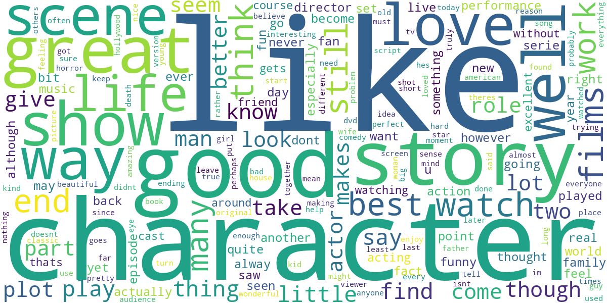
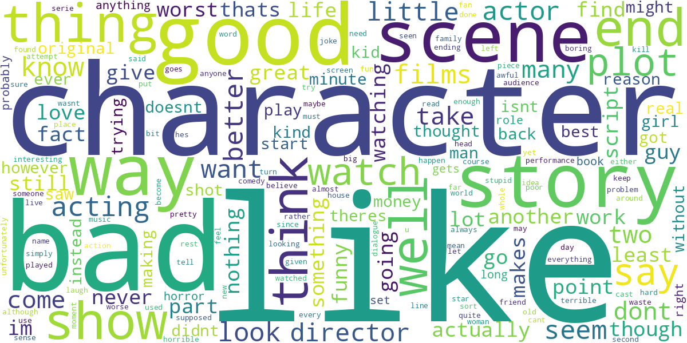
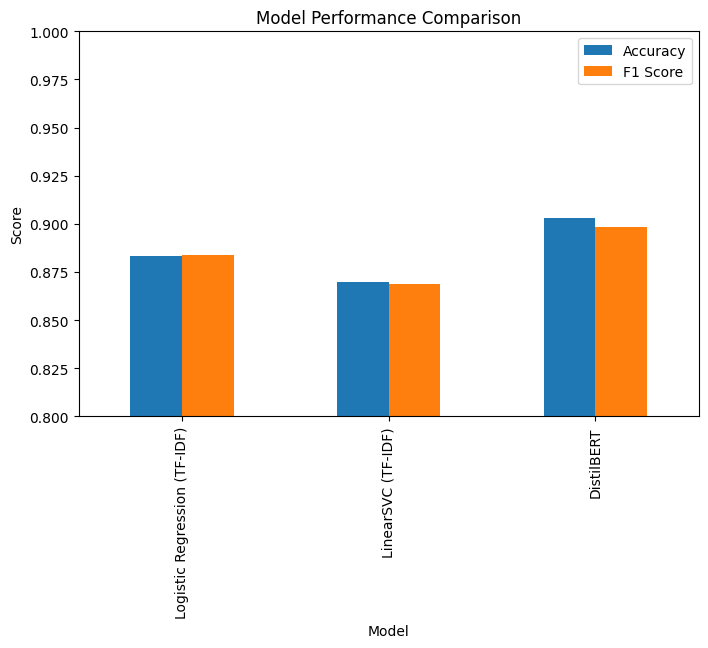
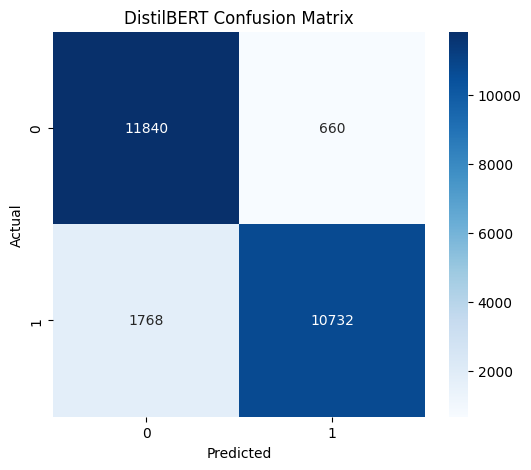

# IMDB Sentiment Analysis using TF-IDF and DistilBERT

🚀 Live Demo: https://huggingface.co/spaces/shravani15/imdb-sentiment-analysis

## Project Overview

This project focuses on binary sentiment classification of movie reviews using the IMDB dataset. The objective is to compare traditional machine learning approaches with transformer-based deep learning models and analyze the performance gains achieved through contextual language understanding.

The project includes:

- Exploratory Data Analysis (EDA)
- Text preprocessing and cleaning
- TF-IDF feature extraction
- Logistic Regression baseline
- LinearSVC baseline
- DistilBERT fine-tuning using Hugging Face Transformers
- Model comparison and evaluation
- Gradio deployment on Hugging Face Spaces

---

## Dataset

**Dataset:** IMDB Movie Reviews Dataset

- 50,000 movie reviews
- Balanced sentiment classes
- 25,000 training samples
- 25,000 testing samples

Target Labels:

- 0 → Negative Review
- 1 → Positive Review

---

## Methodology

### 1. Exploratory Data Analysis

- Class distribution analysis
- Review length analysis
- Word frequency analysis
- Positive and negative WordCloud generation

### 2. Text Preprocessing

- Lowercasing
- HTML tag removal
- Punctuation removal
- Text cleaning

### 3. Feature Engineering

- TF-IDF Vectorization
- Maximum Features: 10,000
- N-grams: (1,2)

### 4. Machine Learning Models

- Logistic Regression
- LinearSVC
- DistilBERT (Fine-Tuned)

### 5. Evaluation Metrics

- Accuracy
- F1-Score
- AUC-ROC
- Confusion Matrix

---

## Model Performance

| Model | Accuracy | F1 Score | AUC-ROC |
|---------|---------:|---------:|---------:|
| Logistic Regression (TF-IDF) | 88.31% | 88.37% | 95.35% |
| LinearSVC (TF-IDF) | 86.99% | 86.86% | — |
| DistilBERT | **90.29%** | **89.84%** | **97.16%** |

---

## Key Findings

- DistilBERT achieved the best overall performance with 90.29% accuracy and 89.84% F1-score.
- Transformer-based models captured contextual relationships more effectively than TF-IDF approaches.
- Logistic Regression provided a strong baseline despite its simplicity.
- DistilBERT demonstrated improved understanding of semantic meaning, negation, and long-range dependencies.

---

## Most Predictive Positive Words

| Word | Coefficient |
|--------|--------:|
| great | 6.39 |
| excellent | 5.98 |
| best | 4.86 |
| wonderful | 4.66 |
| perfect | 4.63 |

## Most Predictive Negative Words

| Word | Coefficient |
|--------|--------:|
| worst | -8.43 |
| bad | -6.74 |
| awful | -6.27 |
| waste | -5.68 |
| boring | -5.41 |

---

## Visualizations

### Positive Review WordCloud



### Negative Review WordCloud



### Model Comparison



### DistilBERT Confusion Matrix



---

## Deployment

The final DistilBERT model was deployed using:

- Gradio
- Hugging Face Spaces

Live Demo:

https://huggingface.co/spaces/shravani15/imdb-sentiment-analysis

---

## Technologies Used

- Python
- Scikit-learn
- Hugging Face Transformers
- PyTorch
- Gradio
- Pandas
- NumPy
- Matplotlib
- Seaborn
- WordCloud

---

## Project Structure

```text
├── README.md
├── requirements.txt
├── app.py
├── Sentiment_Analysis_DistilBERT.ipynb
└── images/
```

---

## Conclusion

This project demonstrates the progression from classical NLP techniques to modern transformer-based architectures. While TF-IDF combined with Logistic Regression established a strong baseline, DistilBERT achieved superior performance by leveraging contextual language understanding. The project was further extended into a production-style workflow through deployment on Hugging Face Spaces using Gradio.
